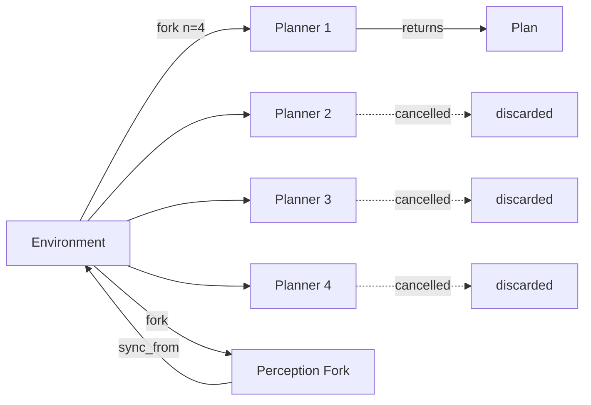
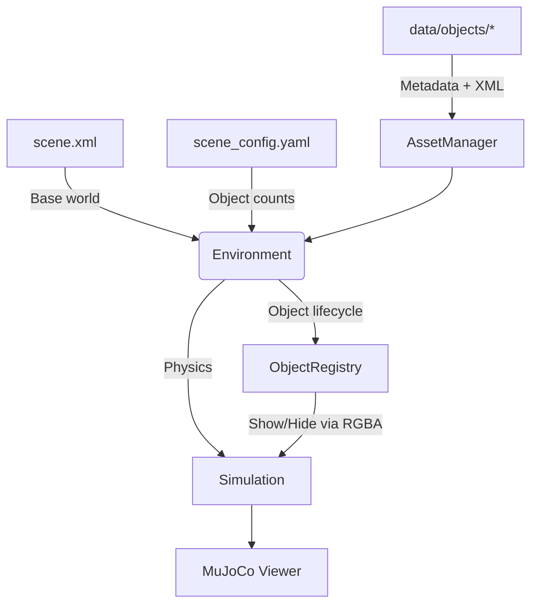

# mj_environment

Dynamic object management for MuJoCo simulations.

## The Problem

MuJoCo models are immutable at runtime—you cannot add or remove bodies without rebuilding the entire simulation. This makes perception-driven robotics challenging: objects detected by vision systems cannot simply appear in the scene.

## The Solution

**mj_environment** pre-initializes all possible objects at load time and controls their visibility via RGBA alpha. Objects "appear" by setting alpha to 1 and "disappear" by setting it to 0, with positions updated through the physics state. This provides dynamic object behavior without regenerating XML or restarting MuJoCo.

## Installation

```bash
git clone https://github.com/personalrobotics/mj_environment.git
cd mj_environment
uv venv && source .venv/bin/activate
uv pip install -e .
```

## Quick Start

```python
from mj_environment import Environment

env = Environment(
    base_scene_xml="data/scene.xml",
    objects_dir="data/objects",
    scene_config_yaml="data/scene_config.yaml",
)

# Activate and position objects
env.update([
    {"name": "cup_0", "pos": [0.1, 0.2, 0.4], "quat": [1, 0, 0, 0]},
    {"name": "plate_0", "pos": [-0.2, 0.0, 0.4], "quat": [1, 0, 0, 0]},
])

# Step physics
env.step()
```

## Forking

`fork()` creates lightweight, independent environment clones. This is useful for two scenarios:

**Motion planning** — Run multiple planners in parallel, each on its own fork. When one planner succeeds, cancel the others via a shared flag. Forks are discarded after use; the original environment remains unchanged throughout.

**Perception processing** — Filter and validate detections in isolation before committing to the main environment. Process noisy sensor data in a fork, then `sync_from()` to apply the cleaned state.



### Planning Example

```python
# Fork for trajectory evaluation - original stays unchanged
planning_env = env.fork()
planning_env.update([{"name": "cup_0", "pos": [0.5, 0.5, 0.4], "quat": [1, 0, 0, 0]}])

for _ in range(100):
    planning_env.sim.step()

# Original is untouched
assert env.data.time == 0.0
```

For parallel planners with early termination:

```python
import threading
from concurrent.futures import ThreadPoolExecutor, as_completed

cancel = threading.Event()

def run_planner(fork, planner, cancel):
    for step in planner.steps():
        if cancel.is_set():
            return None  # Cancelled
        fork.sim.step()
    return planner.get_plan()

forks = env.fork(n=4)
with ThreadPoolExecutor() as executor:
    futures = [executor.submit(run_planner, f, p, cancel) for f, p in zip(forks, planners)]
    for future in as_completed(futures):
        result = future.result()
        if result is not None:
            cancel.set()  # Signal others to stop
            winning_plan = result
            break
```

### Perception Example

```python
# Fork for perception processing - sync back when done
with env.fork() as perception_fork:
    perception_fork.update(filtered_detections, persist=False)
    env.sync_from(perception_fork)
```

### Perception Aliases

Different perception systems (YCB, COCO, custom detectors) can use their own naming conventions. The AssetManager resolves aliases to object types:

```python
obj_type = env.asset_manager.resolve_alias("coffee cup", module="coco")  # Returns "cup"
```

## Architecture



**Environment** composes the MuJoCo scene in memory from:
- `scene.xml` — base world geometry
- `scene_config.yaml` — object types and instance counts
- `data/objects/*/` — per-object XML and metadata

**ObjectRegistry** manages object lifecycle:
- All instances are pre-loaded (e.g., `cup_0`, `cup_1`, `plate_0`)
- Hidden objects have RGBA alpha = 0 and are positioned off-scene
- `activate()` makes an object visible; `hide()` reverses this
- `update()` batch-processes perception detections

## File Structure

```
data/
├── scene.xml           # Base MuJoCo world
├── scene_config.yaml   # Object counts: {cup: 3, plate: 2}
└── objects/
    ├── cup/
    │   ├── model.xml   # MuJoCo geometry
    │   └── meta.yaml   # Metadata (mass, color, perception aliases)
    └── plate/
        ├── model.xml
        └── meta.yaml
```

Example `meta.yaml`:

```yaml
name: cup
category: [kitchenware, drinkware]
mass: 0.25
color: [0.9, 0.9, 1.0, 1.0]
scale: 1.0

mujoco:
  xml_path: model.xml

perception:
  ycb:
    aliases: ["cup", "cup001", "red cup"]
  coco:
    aliases: ["cup", "mug", "coffee cup"]
```

Values in `meta.yaml` (mass, color, scale) override those in `model.xml`.

## Running Demos

```bash
./run_demo.sh demos/dynamic_kitchen_demo.py      # Object activation and forking
./run_demo.sh demos/perception_update_demo.py    # Perception with fork + sync_from
python demos/parallel_planning_demo.py           # Parallel planners with cancellation
```

## API Reference

### Environment

| Method | Description |
|--------|-------------|
| `update(detections, persist=False)` | Batch activate/move/hide objects |
| `fork(n=None)` | Create independent clone(s) for planning |
| `sync_from(other)` | Copy state from another environment |
| `step(ctrl=None)` | Advance physics simulation |
| `reset()` | Reset simulation state |
| `save_state(path)` | Serialize state to YAML |
| `load_state(path)` | Restore state from YAML |
| `get_object_metadata(name)` | Get object properties |

### ObjectRegistry

| Method | Description |
|--------|-------------|
| `activate(obj_type, pos, quat=None)` | Show an inactive object instance |
| `hide(name)` | Hide an active object |
| `update(detections, persist=False)` | Batch process detections |

## License

BSD-3-Clause — [Personal Robotics Laboratory](https://github.com/personalrobotics), University of Washington
