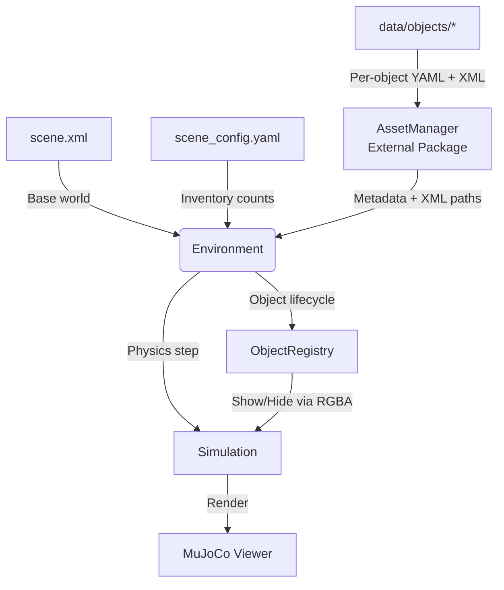

# 🧠 MuJoCo Object Manager  
**Dynamic object handling and organized asset management for MuJoCo**

---

## 🌍 Overview

MuJoCo scenes are **immutable** — once a model is loaded, you can’t add or remove objects without regenerating XML and restarting the simulation.  
At the same time, MuJoCo assets are often **scattered and inconsistent**, mixing geometry, physics, and metadata in a single file.

**MuJoCo Object Manager** solves both problems:

- It **simulates dynamic objects** (appear, move, disappear) **without reloading** MuJoCo.  
- It **organizes assets cleanly**, separating general metadata from MuJoCo-specific definitions for a scalable, maintainable object library.

---

## 🧩 System Architecture



---

## ⚙️ Core Ideas

- **Pre-initialized dynamic objects** — All possible objects are loaded once; visibility is toggled via RGBA alpha.
- **Clean asset separation** — Each object has:
  - `model.xml` → geometry and physical definition
  - `meta.yaml` → general properties (category, mass, color, scale, etc.) and simulator-specific configs
- **Metadata overrides** — Parameters in `meta.yaml` (mass, color, scale) take priority over values in XML files
- **Perception aliases** — Multiple perception modules (YCB, COCO, custom detectors) can use different aliases for the same object, with automatic resolution via AssetManager
- **Forking for planning** — Create lightweight, independent environment clones for motion planning without polluting the original state
- **In-memory composition** — The complete scene is built on the fly using `MjModel.from_xml_string`, with no temporary files.  

---

## 🧠 How It Works

1. **AssetManager** (external package) loads all objects from `data/objects/*`, reading metadata and verifying XML files.
2. **Environment** composes a full MuJoCo scene in memory using:
   - a base `scene.xml`
   - XML paths from AssetManager (via `mujoco.xml_path` in `meta.yaml`)
   - a `scene_config.yaml` specifying object counts
3. **Metadata overrides** are applied — mass, color, and scale from `meta.yaml` override XML values
4. **ObjectRegistry** preloads every object instance (e.g., `cup_0`, `cup_1`, `plate_0`) and hides them (RGBA = 0).
5. **Dynamic updates** happen via `Environment.update()` — objects are activated, moved, or hidden using instance names.
6. **Forking** via `Environment.fork()` creates lightweight clones for planning or perception processing.
7. **StateIO** saves or reloads simulation states to YAML.  

---

## 🧩 Example

```python
from mj_environment import Environment

# Initialize environment
env = Environment(
    base_scene_xml="data/scene.xml",
    objects_dir="data/objects",
    scene_config_yaml="data/scene_config.yaml",
    verbose=True,
)

# Dynamically activate and move objects (use instance names like "cup_0", "plate_1")
env.update([
    {"name": "cup_0", "pos": [0.1, 0.2, 0.4], "quat": [1, 0, 0, 0]},
    {"name": "plate_0", "pos": [-0.2, 0.0, 0.4], "quat": [1, 0, 0, 0]},
])

# Access object metadata (mass, color, scale, category, etc.)
meta = env.get_object_metadata("plate_1")
print(f"Plate mass: {meta['mass']}, color: {meta['color']}, category: {meta['category']}")
```

### Forking for Motion Planning

Create independent environment clones for planning without affecting the original:

```python
# Fork for planning - original environment stays unchanged
planning_env = env.fork()
planning_env.update([{"name": "cup_0", "pos": [0.5, 0.5, 0.4]}])

# Step physics in the fork
for _ in range(100):
    planning_env.sim.step()

# Original env is completely untouched
print(f"Fork time: {planning_env.data.time}, Original time: {env.data.time}")

# Multiple forks for parallel planners
from concurrent.futures import ThreadPoolExecutor

forks = env.fork(n=4)
with ThreadPoolExecutor() as executor:
    results = list(executor.map(planner.plan, forks))
```

### Fork + Sync for Perception Processing

Process perception inputs in a fork, then apply results to the main environment:

```python
# Fork for perception processing
with env.fork() as perception_fork:
    # Filter and process detections in the fork
    perception_fork.update(filtered_detections, persist=False)

    # Apply processed state back to main environment
    env.sync_from(perception_fork)
```

### Perception Aliases

```python
# Resolve perception aliases (using AssetManager)
from asset_manager import AssetManager
assets = AssetManager("data/objects")
obj_type = assets.resolve_alias("red cup", module="ycb")  # Returns "cup"
obj_type = assets.resolve_alias("coffee cup", module="coco")  # Also returns "cup"
```

---

## 🚀 Installation (with [`uv`](https://github.com/astral-sh/uv))

```bash
# 1. Clone the repository
git clone https://github.com/personalrobotics/mj_environment.git
cd mj_environment

# 2. Create a virtual environment
uv venv
source .venv/bin/activate

# 3. Install dependencies in editable mode
# This will automatically install the external AssetManager package
uv pip install -e .
```

> 💡 You can substitute `uv` with `python -m venv` and `pip` if preferred,  
> but `uv` provides faster dependency resolution and reproducible builds.  
> 
> **Note:** The AssetManager is installed as an external dependency from the [asset_manager](https://github.com/personalrobotics/asset_manager) repository.

---

## 🎬 Running Demos with `mjpython`

MuJoCo scripts should always be executed using the `mjpython` interpreter provided by your MuJoCo installation.  
This ensures correct linking to the MuJoCo library and rendering context (GLFW).

**Simplest approach (recommended):** Use the provided helper script which automatically handles the complexity:

```bash
# Dynamic Kitchen Demo – full feature showcase
./run_demo.sh demos/dynamic_kitchen_demo.py

# Perception Update Demo – multiple perception modules with aliases
./run_demo.sh demos/perception_update_demo.py
```

### Demo Features

**Dynamic Kitchen Demo** demonstrates:
- Runtime object activation and movement
- `fork()` for isolated planning simulation
- Context manager support (`with env.fork() as planning_env`)
- Physics stepping in forked environments

**Perception Update Demo** demonstrates:
- Multiple perception modules (YCB, COCO, custom detectors) running concurrently
- Alias-based detection where each module uses its own naming conventions
- `fork()` + `sync_from()` pattern for thread-safe perception updates
- Timeout-based caching (objects remain visible for 2 seconds after detection)

**Manual approach:** If you prefer to run `mjpython` directly, you may need to set `DYLD_LIBRARY_PATH` on macOS when using `uv`:

```bash
source .venv/bin/activate
DYLD_LIBRARY_PATH=$(python -c "import sys; import os; print(os.path.dirname(os.path.dirname(sys.executable)))")/lib .venv/bin/mjpython demos/dynamic_kitchen_demo.py
```

---

## 🏗️ Why It Matters

| Challenge | Solution |
|------------|-----------|
| MuJoCo scenes can't change at runtime | Pre-initialize all objects and control visibility (RGBA = 0 → 1) |
| XML files are cluttered and repetitive | Separate metadata (`meta.yaml`) from simulation files (`model.xml`) |
| Adding new object types requires manual edits | AssetManager auto-discovers per-object directories |
| Need flexible, perception-driven scenes | Dynamic activation via Environment API |
| Motion planning needs isolated simulation | `fork()` creates lightweight clones for planning |
| Perception processing needs thread-safe updates | `fork()` + `sync_from()` pattern for safe state transfer |
| Multiple perception systems use different names | Perception aliases with automatic resolution via AssetManager |

---

## 🧱 Folder Layout

```
data/
  scene.xml
  scene_config.yaml
  objects/
    cup/
      model.xml
      meta.yaml
    plate/
      model.xml
      meta.yaml
```

### Example `meta.yaml` structure:

```yaml
name: cup
category: [kitchenware, drinkware, ceramic]
mass: 0.25
color: [0.9, 0.9, 1.0, 1.0]
scale: 1.0

# Simulator-specific configurations
mujoco:
  xml_path: model.xml

# Multiple perception modules with aliases
perception:
  ycb:
    aliases: ["cup", "cup001", "red cup", "drinking cup"]
    id: 42
  coco:
    aliases: ["cup", "mug", "coffee cup"]
    category_id: 47
  custom_detector:
    aliases: ["red_cup_v2", "cup_small"]
    confidence_threshold: 0.85
```

The `mass`, `color`, and `scale` parameters in `meta.yaml` will override any values specified in the `model.xml` file.

**Perception aliases** allow different perception systems to use their own naming conventions (e.g., YCB uses "cup001", COCO uses "coffee cup"). The AssetManager automatically resolves these aliases to the correct object type, enabling seamless integration with multiple perception pipelines.

---

## 👨‍💻 Author

**Siddhartha Srinivasa**  
Personal Robotics Laboratory, University of Washington  
[siddh@cs.washington.edu](mailto:siddh@cs.washington.edu)

---

## 📄 License

BSD-3-Clause License — consistent with other [Personal Robotics Laboratory](https://github.com/personalrobotics) projects.
