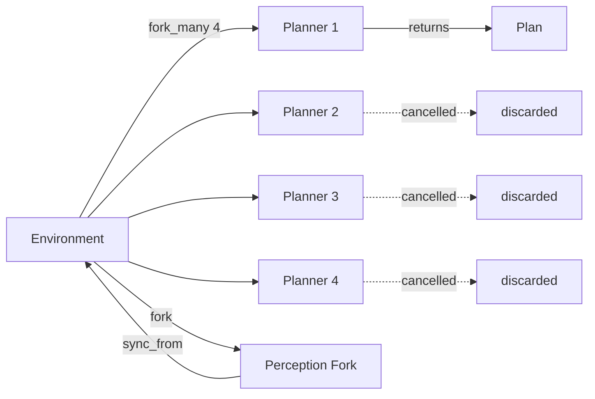
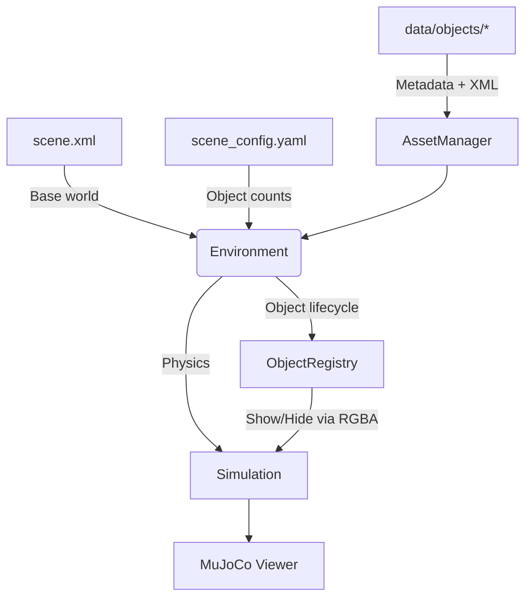

# mj_environment

Dynamic object management for MuJoCo simulations.

## The Problem

MuJoCo models are immutable at runtime—you cannot add or remove bodies without rebuilding the entire simulation. This makes perception-driven robotics challenging: objects detected by vision systems cannot simply appear in the scene.

## The Solution

**mj_environment** pre-initializes all possible objects at load time and controls their visibility via RGBA alpha. Objects "appear" by setting alpha to 1 and "disappear" by setting it to 0, with positions updated through the physics state. This provides dynamic object behavior without regenerating XML or restarting MuJoCo.

## Installation

```bash
git clone https://github.com/personalrobotics/mj_environment.git
cd mj_environment
uv venv && source .venv/bin/activate
uv pip install -e .
```

## Quick Start

```python
from mj_environment import Environment

env = Environment(
    base_scene_xml="data/scene.xml",
    objects_dir="data/objects",
    scene_config_yaml="data/scene_config.yaml",
)

# Activate and position objects
env.update([
    {"name": "cup_0", "pos": [0.1, 0.2, 0.4], "quat": [1, 0, 0, 0]},
    {"name": "plate_0", "pos": [-0.2, 0.0, 0.4], "quat": [1, 0, 0, 0]},
])

# Step physics
env.step()
```

## Forking

`fork()` creates lightweight, independent environment clones for **physics simulation isolation**. Running `mj_step()` modifies simulation state (time, velocities, positions), so forks let you simulate "what if" scenarios without affecting the main environment.

**When you need `fork()`:**
- Running physics forward in time (`mj_step()`)
- Evaluating trajectories that modify simulation state
- Parallel planners that each step their own physics
- Perception processing with speculative object state changes

**When you don't need `fork()`:**
- Collision checking during motion planning — planners typically create their own isolated `MjData` copy internally and only call `mj_forward()` (not `mj_step()`), so they don't modify simulation time or velocities.

**Perception processing** — Filter and validate detections in isolation before committing to the main environment. Process noisy sensor data in a fork, then `sync_from()` to apply the cleaned state.



### Planning Example

```python
# Fork for trajectory evaluation - original stays unchanged
planning_env = env.fork()
planning_env.update([{"name": "cup_0", "pos": [0.5, 0.5, 0.4], "quat": [1, 0, 0, 0]}])

for _ in range(100):
    planning_env.sim.step()

# Original is untouched
assert env.data.time == 0.0
```

For parallel planners with early termination:

```python
import threading
from concurrent.futures import ThreadPoolExecutor, as_completed

cancel = threading.Event()

def run_planner(fork, planner, cancel):
    for step in planner.steps():
        if cancel.is_set():
            return None  # Cancelled
        fork.sim.step()
    return planner.get_plan()

forks = env.fork_many(4)
with ThreadPoolExecutor() as executor:
    futures = [executor.submit(run_planner, f, p, cancel) for f, p in zip(forks, planners)]
    for future in as_completed(futures):
        result = future.result()
        if result is not None:
            cancel.set()  # Signal others to stop
            winning_plan = result
            break
```

### Perception Example

Perception systems produce raw detections (`{type, pos}`) without instance identity. `ObjectTracker` maintains persistent instance names across frames using nearest-neighbor association:

```python
from mj_environment import Environment, ObjectTracker

tracker = ObjectTracker(env.registry, max_distance=0.15)

# Each perception frame:
raw_detections = [
    {"type": "cup", "pos": [0.1, 0.2, 0.4]},
    {"type": "plate", "pos": [0.3, -0.1, 0.4]},
]
updates = tracker.associate(raw_detections)  # Assigns persistent instance names

# Apply via fork/sync for safe updates
with env.fork() as perception_fork:
    perception_fork.update(updates, hide_unlisted=True)
    env.sync_from(perception_fork)
```

`BaseTracker` provides an ABC for drop-in replacements (Kalman, Hungarian).

### Perception Aliases

Different perception systems (YCB, COCO, custom detectors) can use their own naming conventions. The [AssetManager](https://github.com/personalrobotics/asset_manager) resolves aliases to object types:

```python
obj_type = env.asset_manager.resolve_alias("coffee cup", module="coco")  # Returns "cup"
```

## Architecture



**Environment** composes the MuJoCo scene in memory from:
- `scene.xml` — base world geometry
- `scene_config.yaml` — object types and instance counts
- `data/objects/*/` — per-object XML and metadata

**ObjectRegistry** manages object lifecycle:
- All instances are pre-loaded (e.g., `cup_0`, `cup_1`, `plate_0`)
- Hidden objects have RGBA alpha = 0 and are positioned off-scene
- `activate()` makes an object visible; `hide()` reverses this
- `update()` batch-processes perception detections

## File Structure

```
data/
├── scene.xml           # Base MuJoCo world
├── scene_config.yaml   # Object counts: {cup: 3, plate: 2}
└── objects/
    ├── cup/
    │   ├── model.xml   # MuJoCo geometry
    │   └── meta.yaml   # Metadata (mass, color, perception aliases)
    └── plate/
        ├── model.xml
        └── meta.yaml
```

Example `meta.yaml`:

```yaml
name: cup
category: [kitchenware, drinkware]
mass: 0.25
color: [0.9, 0.9, 1.0, 1.0]
scale: 1.0

mujoco:
  xml_path: model.xml

perception:
  ycb:
    aliases: ["cup", "cup001", "red cup"]
  coco:
    aliases: ["cup", "mug", "coffee cup"]
```

Values in `meta.yaml` (mass, color, scale) override those in `model.xml`.

## Running Demos

```bash
./run_demo.sh demos/dynamic_kitchen_demo.py      # Object activation and forking
./run_demo.sh demos/perception_update_demo.py    # ObjectTracker + alias resolution + fork/sync
python demos/parallel_planning_demo.py           # Parallel planners with cancellation
```

## Error Handling

All exceptions inherit from `MjEnvironmentError` for easy catching:

```python
from mj_environment import MjEnvironmentError, ObjectTypeNotFoundError

try:
    env.registry.activate("cupp", [0, 0, 0.5])  # typo
except ObjectTypeNotFoundError as e:
    print(e)
    # Object type 'cupp' not found in registry.
    #   Available types: ['cup', 'plate']
    #   Did you mean: 'cup'?
    #   Hint: Check that 'cupp' is defined in scene_config.yaml.
```

Available exceptions:
- `ObjectTypeNotFoundError` — unknown object type (suggests similar names)
- `ObjectNotFoundError` — unknown object instance
- `ObjectPoolExhaustedError` — all instances of a type are active
- `ConfigurationError` — missing or invalid config files
- `StateError` — state loading/saving issues

## API Reference

### Environment

| Method | Description |
|--------|-------------|
| `update(detections, hide_unlisted=True)` | Batch activate/move/hide objects |
| `fork()` | Create independent clone for planning |
| `fork_many(n)` | Create multiple independent clones |
| `sync_from(other)` | Copy state from another environment |
| `step(ctrl=None)` | Advance physics simulation |
| `reset()` | Reset simulation state |
| `status(verbose=False)` | Get scene status (active objects, positions) |
| `save_state(path)` | Serialize state to YAML |
| `load_state(path)` | Restore state from YAML |
| `get_object_metadata(name)` | Get object properties |

### ObjectTracker

| Method | Description |
|--------|-------------|
| `ObjectTracker(registry, max_distance=0.15)` | Create tracker with nearest-neighbor association |
| `associate(detections)` | Map `{type, pos}` dicts to persistent `{name, pos, quat}` updates |
| `reset()` | Clear all tracking state |

Subclass `BaseTracker` to implement custom association (Kalman, Hungarian).

### ObjectRegistry

| Method | Description |
|--------|-------------|
| `activate(obj_type, pos, quat=None)` | Show an inactive object instance |
| `hide(name)` | Hide an active object |
| `update(detections, hide_unlisted=True)` | Batch process detections |
| `is_active(name)` | Check if an object is currently active |
| `get_active_instances(obj_type=None)` | Get list of active object names |

## Logging

mj_environment uses Python's `logging` module. Configure it to see debug output:

```python
import logging
logging.basicConfig(level=logging.DEBUG)

# Or for mj_environment only:
logging.getLogger("mj_environment").setLevel(logging.DEBUG)
```

The `verbose=True` parameter still works for backward compatibility and enables DEBUG-level logging automatically.

## License

BSD-3-Clause — [Personal Robotics Laboratory](https://github.com/personalrobotics), University of Washington
