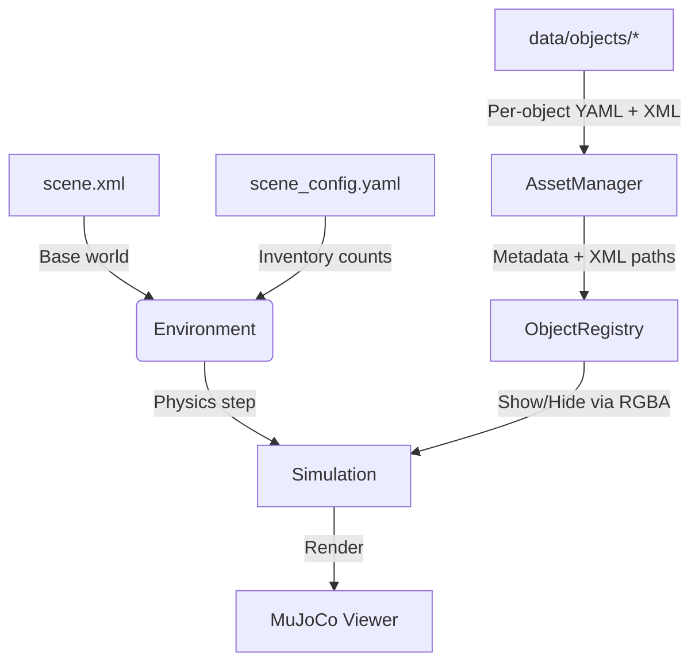

# 🧠 MuJoCo Object Manager  
**Dynamic object handling and organized asset management for MuJoCo**

---

## 🌍 Overview

MuJoCo scenes are **immutable** — once a model is loaded, you can’t add or remove objects without regenerating XML and restarting the simulation.  
At the same time, MuJoCo assets are often **scattered and inconsistent**, mixing geometry, physics, and metadata in a single file.

**MuJoCo Object Manager** solves both problems:

- It **simulates dynamic objects** (appear, move, disappear) **without reloading** MuJoCo.  
- It **organizes assets cleanly**, separating general metadata from MuJoCo-specific definitions for a scalable, maintainable object library.

---

## 🧩 System Architecture



---

## ⚙️ Core Ideas

- **Pre-initialized dynamic objects** — All possible objects are loaded once; visibility is toggled via RGBA alpha.  
- **Clean asset separation** — Each object has:
  - `model.xml` → geometry and physical definition  
  - `meta.yaml` → general properties (category, mass, color, scale, etc.)
- **In-memory composition** — The complete scene is built on the fly using `MjModel.from_xml_string`, with no temporary files.  

---

## 🧠 How It Works

1. **AssetManager** loads all objects from `data/objects/*`, reading metadata and verifying XML files.  
2. **Environment** composes a full MuJoCo scene in memory using:
   - a base `scene.xml`
   - a `scene_config.yaml` specifying object counts  
3. **ObjectRegistry** preloads every object and hides it (RGBA = 0).  
4. **Dynamic updates** happen via `Environment.update()` — objects are activated, moved, or hidden.  
5. **StateIO** saves or reloads simulation states to YAML.  

---

## 🧩 Example

```python
from mj_environment import Environment

# Initialize environment
env = Environment(
    base_scene_xml="data/scene.xml",
    objects_dir="data/objects",
    scene_config_yaml="data/scene_config.yaml",
    verbose=True,
)

# Dynamically activate and move objects
env.update([
    {"name": "cup", "pos": [0.1, 0.2, 0.4], "quat": [1, 0, 0, 0]},
    {"name": "plate", "pos": [-0.2, 0.0, 0.4], "quat": [1, 0, 0, 0]},
])
```

---

## 🚀 Installation (with [`uv`](https://github.com/astral-sh/uv))

```bash
# 1. Clone the repository
git clone https://github.com/personalrobotics/mj_environment.git
cd mj_environment

# 2. Create a virtual environment
uv venv
source .venv/bin/activate

# 3. Install dependencies in editable mode
uv pip install -e .
```

> 💡 You can substitute `uv` with `python -m venv` and `pip` if preferred,  
> but `uv` provides faster dependency resolution and reproducible builds.

---

## 🎬 Running Demos with `mjpython`

MuJoCo scripts should always be executed using the `mjpython` interpreter provided by your MuJoCo installation.  
This ensures correct linking to the MuJoCo library and rendering context (GLFW).

```bash
# Activate environment first
source .venv/bin/activate

# Dynamic Kitchen Demo – full feature showcase
mjpython demos/dynamic_kitchen_demo.py

# Perception Update Demo – threaded perception and persistence
mjpython demos/perception_update_demo.py

# Asset Manager Demo – view loaded categories, overrides, and metadata
mjpython demos/asset_manager_demo.py
```

---

## 🏗️ Why It Matters

| Challenge | Solution |
|------------|-----------|
| MuJoCo scenes can’t change at runtime | Pre-initialize all objects and control visibility (RGBA = 0 → 1) |
| XML files are cluttered and repetitive | Separate metadata (`meta.yaml`) from simulation files (`model.xml`) |
| Adding new object types requires manual edits | AssetManager auto-discovers per-object directories |
| Need flexible, perception-driven scenes | Dynamic activation and state cloning via Environment API |

---

## 🧱 Folder Layout

```
data/
  scene.xml
  scene_config.yaml
  objects/
    cup/
      model.xml
      meta.yaml
    plate/
      model.xml
      meta.yaml
```

---

## 👨‍💻 Author

**Siddhartha Srinivasa**  
Personal Robotics Laboratory, University of Washington  
[siddh@cs.washington.edu](mailto:siddh@cs.washington.edu)

---

## 📄 License

BSD-3-Clause License — consistent with other [Personal Robotics Laboratory](https://github.com/personalrobotics) projects.
